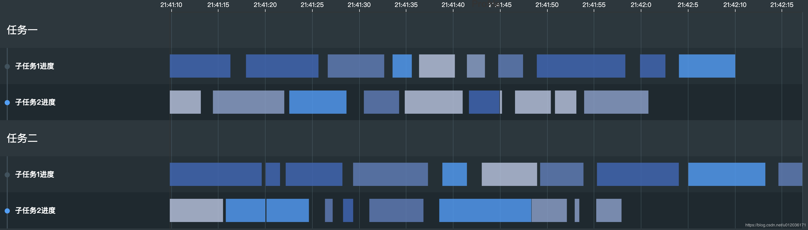

## 👉 GanttChart 任务甘特图

* 🤔 项目最近做任务排产，需要绘画甘特图，并且每两份一组，做了一个JQuery快速做了POC，实现了大部分功能，后来持续开发，做到了划定当前时间，任务多了后固定左侧列和顶部坐标轴行等等。
* 分享博客的话就简单的分享一下做的POC吧。实现的初步效果如下

## 📖 分析：
* 左侧的轴样式美观程度比较高，且需要分组，分类，我初次尝试echarts分组，样式自定义程度不好，距离还得xy算偏移量
* 左侧使用css 右侧使用echarts，则会出现图表和css自定义的样式行对不上等等，分类随时还需要空一行
* 每个不同的生产内容颜色区块，需要对齐时间
....等等

## 📝 实现：
* 先画左侧的样式，固定好行高
* echarts.graphic.clipRectByRect 自定义左侧Echarts
* 自定义categories中的一组数据为blank，则表示要空一行数据
* 采用时间坐标

